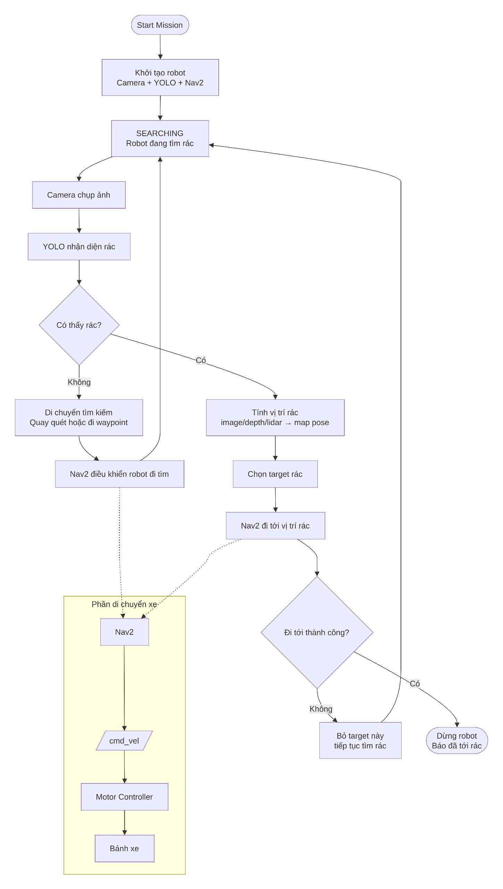

# CleanRobot_STU


# System Requirements:
 - Ubuntu 24.04 LTS
 - Cài Ubuntu đi.

# Tài liệu:

install werobots: 
``` cmd
sudo snap install webots
```

install ros2(tham khảo: https://docs.ros.org/en/foxy/Installation/Ubuntu-Install-Debians.html)
``` cmd
locale  # check for UTF-8

sudo apt update && sudo apt install locales
sudo locale-gen en_US en_US.UTF-8
sudo update-locale LC_ALL=en_US.UTF-8 LANG=en_US.UTF-8
export LANG=en_US.UTF-8

locale  # verify settings

```

```
sudo apt install software-properties-common
sudo add-apt-repository universe
```

```
sudo apt update && sudo apt install curl -y
sudo curl -sSL https://raw.githubusercontent.com/ros/rosdistro/master/ros.key -o /usr/share/keyrings/ros-archive-keyring.gpg
```

```
echo "deb [arch=$(dpkg --print-architecture) signed-by=/usr/share/keyrings/ros-archive-keyring.gpg] http://packages.ros.org/ros2/ubuntu $(. /etc/os-release && echo $UBUNTU_CODENAME) main" | sudo tee /etc/apt/sources.list.d/ros2.list > /dev/null
```

```
sudo apt update
```

```
sudo apt upgrade
```

```
sudo apt install ros-jazzy-desktop python3-argcomplete -y
```

```
echo "source /opt/ros/jazzy/setup.bash" >> ~/.bashrc
source ~/.bashrc
```


Kiểm tra:
```
ros2 --version
ros2 topic list
```


cầu nối giửa ros2 và werobots
``` cmd
    sudo apt install ros-jazzy-webots-ros2 -y
```

cài nav
```
sudo apt install ros-jazzy-navigation2 ros-jazzy-nav2-bringup    
```




Cấu trúc package:
```cmd
clean_robot_ws/

└── src/

    ├── clean_robot_msgs/# đây là nơi lưu trữ state dùng chung: x,y,z, confident,...
    ├── clean_robot_description/ # đây là package mô tả cấu trúc của xe.
    ├── clean_robot_perception/ # đây là package sử dụng computer vision. 
    ├── clean_robot_mission/ # Package này là phần điều phối nhiệm vụ. ~  Nếu chưa thấy rác → cho robot đi tìm
                                                                    Nếu thấy rác → gửi goal cho Nav2 đi tới rác
                                                                    Nếu tới rác → dừng nhiệm vụ
                                                                    Nếu fail → quay lại tìm tiếp
    ├── clean_robot_navigation/ # Package này chứa config cho Nav2, SLAM, AMCL, map
    ├── clean_robot_base/ # Package này chứa config cho Nav2, SLAM, AMCL, map trong thế giới thật. có thể bỏ qua
    ├── clean_robot_simulation/ # điều khiển xe chạy trong môi werobots
    └── clean_robot_bringup/ # thực hiện nằng đồ vật. chức năng này bỏ qua.
```


Thao khảo: [CleanRobot_STU_TEAM_GUIDE.pdf](docs/CleanRobot_STU_TEAM_GUIDE.pdf). Chúc mọi người làm việc tốt <3.


clean_robot_ws/

└── src/

    ├── clean_robot_msgs/                                           # Duy Khang
    ├── clean_robot_description/                                    # Duy Khang
    ├── clean_robot_perception/                                     # Khải
    ├── clean_robot_mission/                                        # Khải
    ├── clean_robot_navigation/                                     # Khang, Khải
    └── clean_robot_simulation/                                     # Hoài


